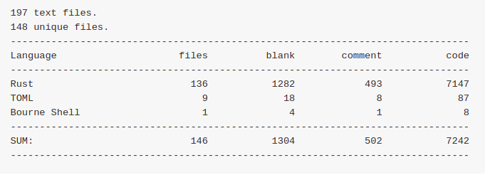
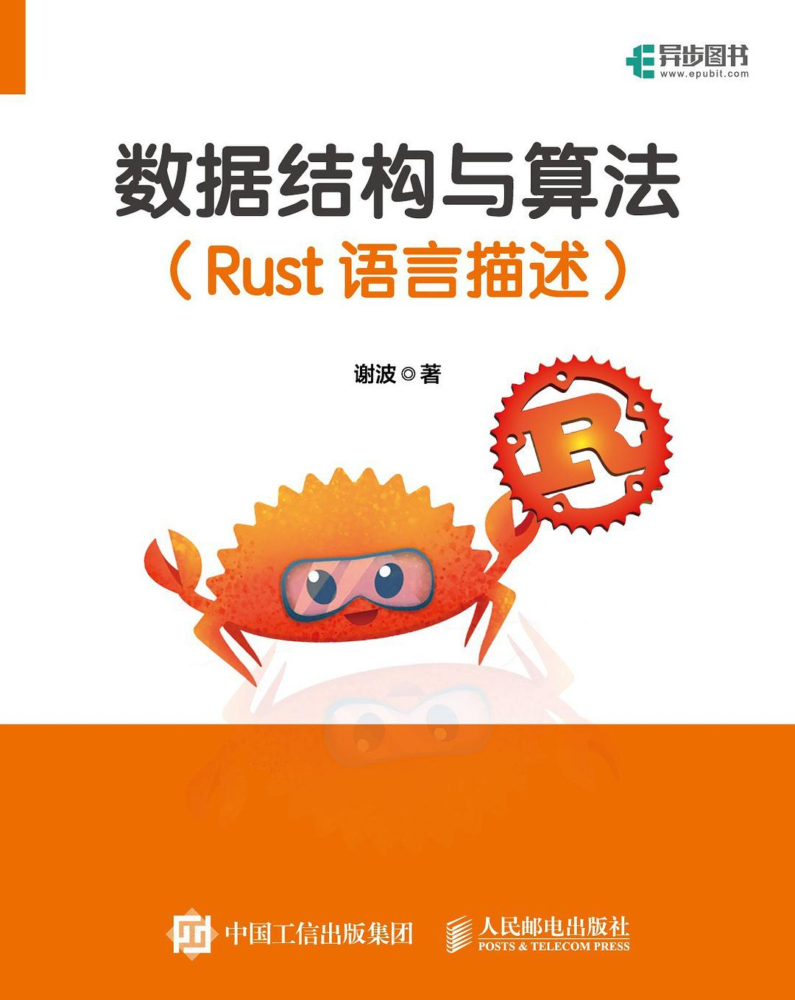

### Description  [[简](./README_CN.md)、[繁](./README_TW.md)] 

A book about [Rust programming language](https://www.rust-lang.org/) written in Simplified, Tranditional Chinese and English(80%). This book contains 10 chapters in which are some data structures and algorithms with demos.

* Chapter 1: Rust basic
    - Review of Rust fundamentals
    - Learning resources
* Chapter 2: Computer Science
    - Computer science concepts
* Chapter 3: Algorithm Analysis
    - Big-O notation
* Chapter 4: Basic Data Structures
    - Stack, Queue, Deque, List, Vec
* Chapter 5: Recursion
    - Recursion theory, Tail-recursion  ,Dynamic programming
* Chapter 6: Search
    - Sequencial search, Binary search, Hashing search
* Chapter 7: Sort
    - Ten basic sort algorithms
* Chapter 8: Tree
    - Binary tree, Binary heap, Binary search tree, AVL tree
* Chapter 9: Graph
    - Graph representation, BFS, DFS, Shortest path
* Chapter 10: Practice
    - Edit Distance, Trie, Filter, LRU
    - Consistent hashing, Base58, Blockchain

### Code 

All demo codes are saved by chapter under `publication/code/`.

<!-- ### Stargazer

-->

### Changelog 
* 2023-06-18 add publication edition info
* 2023-04-29 add english version of the book
* 2022-05-15 add a new directory `publication`
* 2022-02-27 change the book cover
* 2022-02-15 add stargazer chart
* 2022-02-12 add code statistics
* 2022-02-09 fix typo and `substract with overflow` panic
* 2022-02-06 change code font to monospaced font: [Source Code Pro](https://github.com/adobe-fonts/source-code-pro)
* 2022-02-02 update to rust version 1.58
* 2022-01-31 upload code and the implementation [Simplified and Traditional Chinese Version]
* 2021-04-24 upload first draft

### Publication

Now, Chinese edition has been published with 40% more contents than the open-sourced one.

